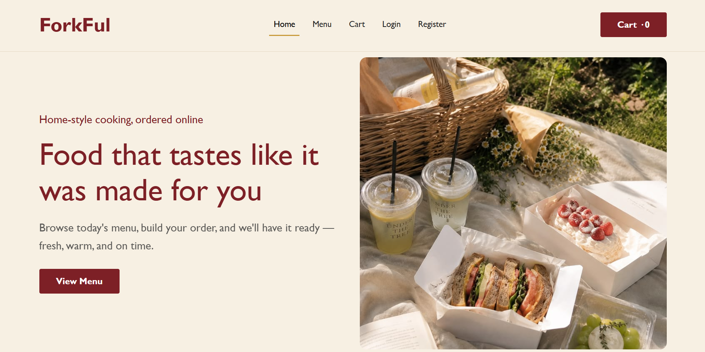
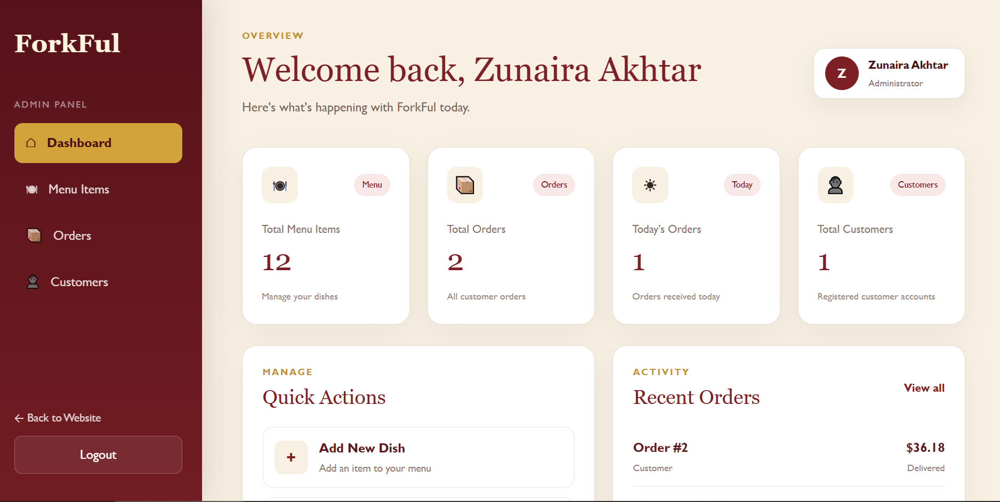
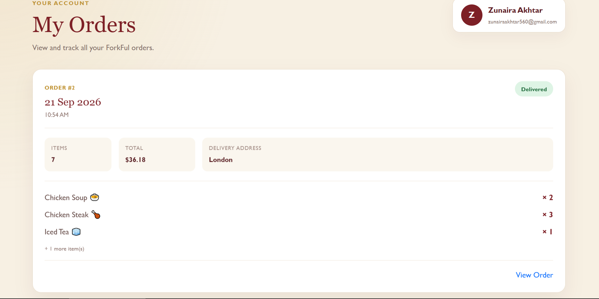
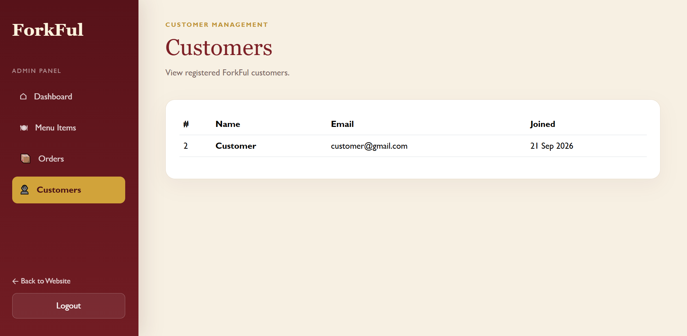

# ForkFul

ForkFul is a Laravel-based online food ordering website that allows customers to browse menu items, manage a cart, place orders, and track their order history.

The application also includes an administrator dashboard for managing menu items, customers, orders, and order statuses.

---

## 📸 Project Preview

### Home Page



### Admin Dashboard



### Admin Orders



### Customer Orders



---

## Features

### Customer Features

* Customer registration and login
* Secure authentication
* Dynamic food menu
* Category-based menu filtering
* Add items to cart
* Increase or decrease cart quantity
* Automatic cart price synchronization
* Checkout and delivery details
* Place food orders
* View personal order history
* View individual order details
* Cancel an order while it is still pending
* Track order status

### Admin Features

* Admin authentication and protected routes
* Dashboard with live statistics
* View total menu items
* View total orders
* View today's orders
* View registered customers
* View recent orders
* Add new menu items
* Edit menu items
* Delete menu items
* View customer orders
* View individual order details
* Update order status

---

## Order Status Flow

Orders follow this status flow:

```text
Pending → Preparing → Delivered

Pending → Cancelled
```

Delivered and Cancelled orders are final states.

Customers can cancel an order only while its status is Pending.

---

## Cart Behaviour

The ForkFul cart is stored in the Laravel session.

The cart also synchronizes with the database so that:

* Updated menu prices are reflected in the cart
* Deleted menu items are safely removed
* Invalid quantities are ignored
* Checkout uses current menu prices

---

## Order History

Customer order history remains available even if a menu item is deleted later.

If an ordered dish no longer exists, the previous order remains available and the item is displayed as:

```text
Deleted Item
```

This helps preserve historical order records.

---

## Technologies Used

* PHP 8.2+
* Laravel 12
* MySQL
* Blade
* HTML5
* CSS3
* JavaScript
* Bootstrap 5
* Git
* GitHub

---

## Installation

Clone the repository:

```bash
git clone https://github.com/zunaira-dev22/Forkful.git
```

Move into the project directory:

```bash
cd Forkful
```

Install PHP dependencies:

```bash
composer install
```

Create the environment file on Windows:

```bash
copy .env.example .env
```

On macOS or Linux:

```bash
cp .env.example .env
```

Generate the Laravel application key:

```bash
php artisan key:generate
```

Create a MySQL database named:

```text
forkful
```

Configure the database connection in `.env`:

```env
DB_CONNECTION=mysql
DB_HOST=127.0.0.1
DB_PORT=3306
DB_DATABASE=forkful
DB_USERNAME=root
DB_PASSWORD=
```

Run the migrations:

```bash
php artisan migrate
```

Run the database seeders if required:

```bash
php artisan db:seed
```

Start the Laravel development server:

```bash
php artisan serve
```

Open the website at:

```text
http://127.0.0.1:8000
```

---

## User Roles

ForkFul supports two user roles.

### Customer

Customers can:

* Browse menu items
* Manage their cart
* Checkout
* Place orders
* View their own order history
* View individual order details
* Cancel pending orders
* Track order status

### Administrator

Administrators can:

* Access the admin dashboard
* Manage menu items
* View registered customers
* View all customer orders
* View individual order details
* Update order statuses

---

## Main Project Structure

```text
app/
├── Http/
│   ├── Controllers/
│   │   └── Admin/
│   └── Middleware/
└── Models/

database/
├── migrations/
└── seeders/

public/
├── css/
├── images/
└── js/

resources/
└── views/
    ├── admin/
    ├── auth/
    └── customer/

routes/
└── web.php

screenshots/
├── home.png
├── admin-dashboard.png
├── admin-orders.png
└── customer-orders.png
```

---

## Security

* Passwords are securely hashed
* CSRF protection is enabled on forms
* Admin routes are protected by admin middleware
* Customer-only routes are protected by customer middleware
* Customers can only access their own orders
* Order status transitions are validated server-side
* Sensitive `.env` information is excluded from GitHub

---

## Environment

ForkFul is currently configured with:

```text
Laravel 12
PHP 8.2+
MySQL
Timezone: Asia/Karachi
```

---

## Project Purpose

ForkFul was developed as a full-stack Laravel food ordering project to demonstrate:

* Authentication
* Role-based authorization
* CRUD operations
* Session-based cart management
* Database relationships
* Order processing
* Middleware
* Responsive frontend design
* Git and GitHub version control

---

## ForkFul

**Home-style cooking, ordered online.**
